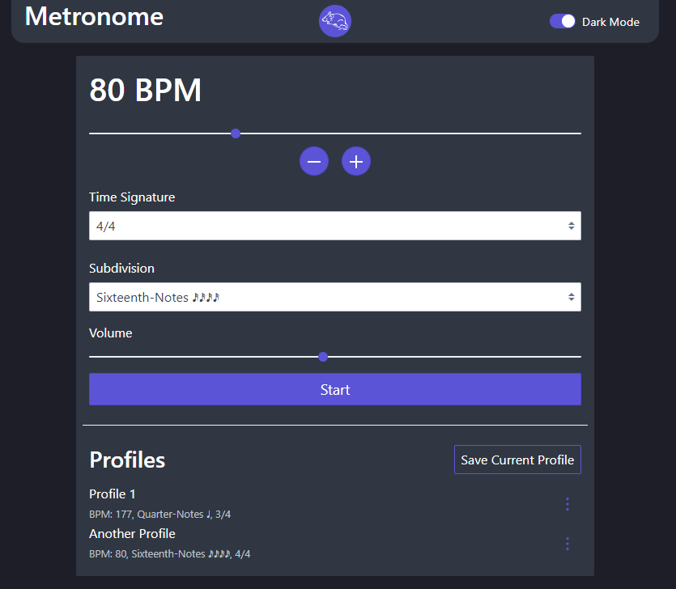

# Simple Metronome

A simple browser-based metronome with the following features:
- Tempo: 30bpm - 200bpm
- Time Signatures: 4/4, 3/4, 2/4
- Subdivisions: Quarter Notes, Eighth Notes, Triplets, Sixteenth Notes 

Try it out [here](https://eatmygoose.github.io/Metronome/index.html)



## Credits:

Original Sound Clip: ```https://www.soundsnap.com/tags/claves - Claves percussion loop - BPM 100 5```
Reference Image: ```https://commons.wikimedia.org/wiki/File:White-toothed_woodrat.jpg```
